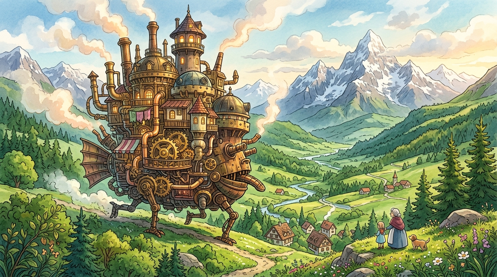
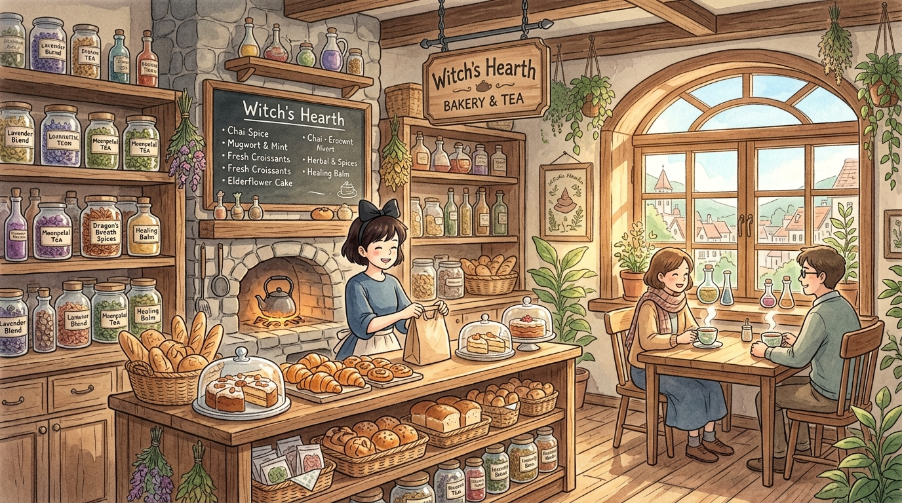
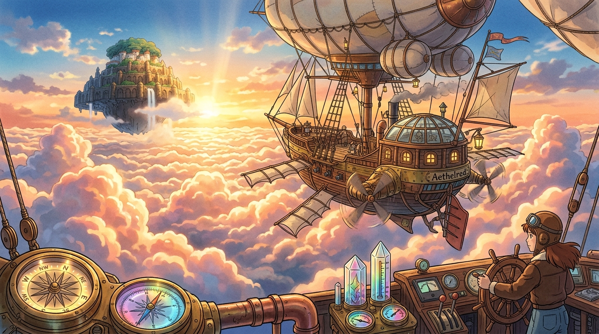

<div align="center">

<!-- HERO MEADOW BANNER -->
<a href="https://github.com/dharmamudita">
  
</a>

<br/><br/>

<!-- HEADER TITLE CARD (NEOBRUTALISM / GHIBLI WARMTH) -->
<table align="center" border="0">
  <tr>
    <td align="center" style="background-color: #FEFAE0; border: 3px solid #283618; border-radius: 28px; padding: 14px 32px; box-shadow: 6px 6px 0px #283618;">
      <h1 align="center" style="color: #283618; margin: 0; font-family: 'Comfortaa', cursive, sans-serif; font-size: 26px;">
        🌿 Dharma Mudita
      </h1>
      <p align="center" style="color: #606C38; margin: 4px 0 0 0; font-size: 15px; font-weight: bold;">
        Full-Stack Engineer &bull; Next.js &amp; TypeScript Specialist &bull; AI Explorer
      </p>
    </td>
  </tr>
</table>

<br/>

<!-- ANIMATED TYPING SUBTITLE -->
<a href="https://github.com/dharmamudita">
  
</a>

<br/>

<!-- FEATURED NEXT.JS / TYPESCRIPT PORTFOLIO CALLOUT -->
<p align="center">
  <a href="https://github.com/dharmamudita">
    
  </a>
</p>

</div>

<br/>

---

## 📜 Profile Overview

<table align="center" border="0" width="100%">
  <tr>
    <!-- POLAROID AVATAR CARD -->
    <td width="40%" align="center" valign="top">
      <div style="background-color: #FEFAE0; border: 3px solid #283618; border-radius: 20px; padding: 16px; box-shadow: 6px 6px 0px #283618;">
        <p align="center" style="margin-top: -4px; margin-bottom: 8px;">
          <br/>
          
        </p>
        <h3 align="center" style="color: #283618; margin: 4px 0 2px 0;">Dharma Mudita</h3>
        <p align="center" style="font-size: 13px; color: #606C38; margin: 0 0 8px 0;">
          <i>Software Engineer &amp; Creative Technologist</i>
        </p>
        <p align="center" style="margin: 0;">
          
        </p>
      </div>
      <br/>
      <div style="background-color: #FFFDF0; border: 2px dashed #BC6C25; border-radius: 14px; padding: 10px 14px; text-align: center;">
        <p style="font-size: 13px; color: #283618; margin: 0; font-weight: 500;">
          💡 <i>"Crafting code with the precision of engineering and the warmth of storytelling."</i>
        </p>
      </div>
    </td>

    <!-- BIOGRAPHY & DETAILS -->
    <td width="60%" valign="top" style="padding-left: 18px;">
      <div style="background-color: #FEFAE0; border: 3px solid #283618; border-radius: 20px; padding: 18px 22px; box-shadow: 6px 6px 0px #283618;">
        <h3 style="color: #283618; margin-top: 0;">About Me</h3>
        <p style="color: #283618; line-height: 1.6; font-size: 14px; margin-bottom: 12px;">
          Hi there! I am a <b>Full-Stack Software Engineer</b> based in Bandar Lampung, Indonesia. I specialize in building modern, performant, and delightful web applications using <b>TypeScript</b>, <b>Next.js</b>, and modern cloud architectures, combined with cutting-edge <b>AI &amp; Computer Vision</b> systems.
        </p>
        <ul style="color: #283618; font-size: 14px; line-height: 1.8; list-style: none; padding-left: 0; margin-bottom: 0;">
          <li>📍 <b>Location:</b> Bandar Lampung, Indonesia 🇮🇩</li>
          <li>🎓 <b>Education:</b> Universitas Teknokrat Indonesia (Informatika / Computer Science)</li>
          <li>💻 <b>Specialization:</b> React, Next.js (App Router), TypeScript, Node.js, Python, Laravel</li>
          <li>🤖 <b>AI Interests:</b> Deep Learning, LLM Integrations, OpenCV &amp; Image Processing</li>
          <li>🎨 <b>Creative Skills:</b> UI/UX Design (Figma), Video Production &amp; Photography</li>
        </ul>
      </div>
    </td>
  </tr>
</table>

<br/>

<!-- TYPESCRIPT ARCHITECTURE SPECIFICATION BLOCK -->
<div align="center">
  <div style="background-color: #1E351E; border: 3px solid #283618; border-radius: 20px; padding: 18px 24px; box-shadow: 6px 6px 0px #283618; text-align: left; max-width: 96%;">
    <p style="color: #DDA15E; font-weight: bold; margin: 0 0 8px 0; font-family: monospace; font-size: 14px;">
      ⚡ developer.config.ts
    </p>

```typescript
import { type FullStackDeveloper } from "@dharmamudita/core";

export const dharma: FullStackDeveloper = {
  identity: {
    name: "Dharma Mudita",
    primaryRole: "Full-Stack Engineer & AI Creative",
    location: "Bandar Lampung, Indonesia",
  },
  frontend: {
    frameworks: ["Next.js 14+", "React", "TypeScript", "TailwindCSS"],
    stateManagement: ["Redux Toolkit", "Zustand"],
    uiParadigm: ["Server Components", "Responsive Design", "Micro-animations"],
  },
  backend: {
    runtimes: ["Node.js", "Express.js", "Python (FastAPI / Flask)", "Laravel (PHP)"],
    databases: ["PostgreSQL", "MySQL", "MongoDB", "Supabase", "Prisma ORM", "Redis"],
  },
  artificialIntelligence: {
    libraries: ["TensorFlow", "PyTorch", "OpenCV", "LangChain", "Hugging Face"],
  },
};
```
  </div>
</div>

<br/>

---

## 🛠️ Tech Stack & Ecosystem

<div align="center">

### Programming Languages


### Frameworks & Libraries


### Databases & Cloud Services


### AI & Machine Learning


### Creative Tools & DevOps


</div>

<br/>

---

## 🏰 Featured Projects & Architecture

<table align="center" border="0" width="100%">
  <tr>
    <td width="33%" valign="top" align="center">
      <div style="background-color: #FEFAE0; border: 3px solid #283618; border-radius: 18px; padding: 12px; box-shadow: 5px 5px 0px #283618;">
        
        <h4 style="color: #283618; margin: 10px 0 4px 0;">Castle Web Engine</h4>
        <p style="color: #606C38; font-size: 12px; margin: 0;">Next.js &amp; TypeScript application platform with modular micro-services.</p>
      </div>
    </td>
    <td width="33%" valign="top" align="center">
      <div style="background-color: #FEFAE0; border: 3px solid #283618; border-radius: 18px; padding: 12px; box-shadow: 5px 5px 0px #283618;">
        
        <h4 style="color: #283618; margin: 10px 0 4px 0;">Cozy Cafe Ecosystem</h4>
        <p style="color: #606C38; font-size: 12px; margin: 0;">Full-stack online ordering &amp; reservation system with TailwindCSS.</p>
      </div>
    </td>
    <td width="33%" valign="top" align="center">
      <div style="background-color: #FEFAE0; border: 3px solid #283618; border-radius: 18px; padding: 12px; box-shadow: 5px 5px 0px #283618;">
        
        <h4 style="color: #283618; margin: 10px 0 4px 0;">Sky Radar &amp; Analytics</h4>
        <p style="color: #606C38; font-size: 12px; margin: 0;">Real-time AI telemetry &amp; analytics dashboard built with Python &amp; React.</p>
      </div>
    </td>
  </tr>
</table>

<br/>

---

## 📊 GitHub Analytics & Activity

<div align="center">
  <!-- WARM FOREST & AMBER GHIBLI STATS -->
  
  
</div>

<br/>

<div align="center">
  <!-- WARM GHIBLI STREAK STATS -->
  
</div>

<br/>

<div align="center">
  <!-- ACTIVITY GRAPH -->
  
</div>

---

## 🐍 Contribution Activity (Snake)

<div align="center">
  <picture>
    <source media="(prefers-color-scheme: dark)" srcset="https://github.com/dharmamudita/dharmamudita/blob/output/github-snake-dark.svg?raw=true" />
    <source media="(prefers-color-scheme: light)" srcset="https://github.com/dharmamudita/dharmamudita/blob/output/github-snake.svg?raw=true" />
    
  </picture>
</div>

---

## 📬 Connect & Collaborate

<div align="center">

<p style="font-size: 15px; color: #283618; font-weight: 500;">Interested in collaborating on a new project or discussing technology? Feel free to reach out:</p>

[](https://www.instagram.com/voltxdharma)
[](https://www.linkedin.com/in/dharma-mudita-a7421641a)
[](mailto:dharmamudita404@gmail.com)
[](https://github.com/dharmamudita)
[](https://www.tiktok.com/@anothervoltz)

<br/><br/>

<a href="https://github.com/dharmamudita">
  
</a>

<p align="center" style="margin-top: 14px;">
  <small style="color: #606C38; font-weight: bold;">🌱 Crafted with dedication by Dharma Mudita 🌱</small>
</p>

</div>
